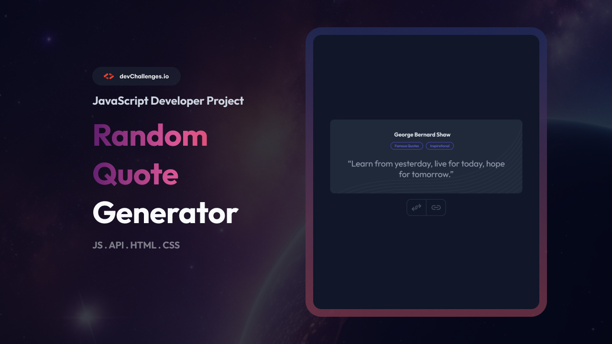
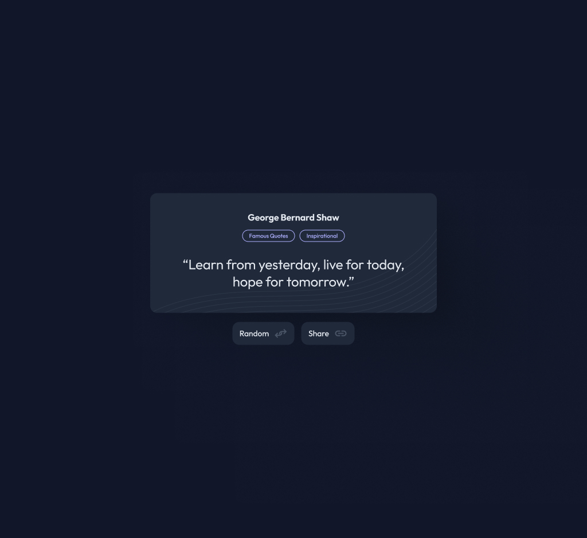
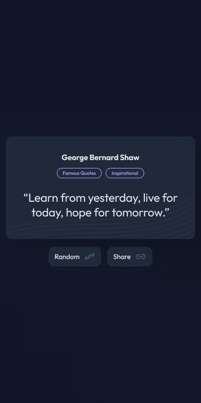

# Random Quote Generator | devChallenges

A modern and fully responsive web application that displays random inspirational quotes with author and tags. Built as a solution to the devChallenges.io Random Quote challenge, this project demonstrates best practices in UI/UX, accessibility, and web standards.




## Overview
This project is a pixel-perfect implementation of the Random Quote challenge from devChallenges.io. It features a modern card UI, subtle SVG background, and responsive design for desktop, tablet, and mobile. Users can generate random quotes and share them easily. The project demonstrates:

- Clean, maintainable HTML, CSS, and JavaScript
- Accessibility and semantic markup
- Responsive design for all device sizes
- Professional UI/UX and attention to detail

| Desktop | Tablet | Mobile |
| ------- | ------ | ------ |
|  |  |  |

## Features
- Responsive card layout with modern design
- Random quote generation with author and tags
- Share quote functionality (Web Share API & clipboard fallback)
- Subtle SVG background inside the card
- Accessible and semantic HTML
- Fully responsive for all device sizes
- Easy to customize and extend


## Getting Started

To get a local copy up and running, follow these simple steps:

1. **Clone the repository:**
   ```sh
   git clone https://github.com/Ayokanmi-Adejola/Random-Quote-Generator
   ```
2. **Navigate to the project directory:**
   ```sh
   cd random-quote-generator
   ```
3. **Open `index.html` in your browser.**

## Usage

- Click the **Random** button to generate a new quote.
- Use the **Share** button to share the current quote (via Web Share API or clipboard).
- The app is fully responsive and works on all modern browsers and devices.

## Built With
- HTML5 & CSS3 (Flexbox, Media Queries)
- Vanilla JavaScript
- [Raleway](https://fonts.google.com/specimen/Raleway) Google Font

## Project Structure
```
random-quote-master/
├── index.html
├── README.md
├── README_template.md
├── thumbnail.jpg
├── design/
│   ├── Desktop_1350px.jpg
│   ├── Mobile_412px.jpg
│   └── Tablet_1024px.jpg
├── resources/
│   ├── bg-image-random-quote.png
│   ├── bg-image-random-quote.svg
│   ├── favicon.ico
│   ├── link.svg
│   └── regroup.svg
```

## Contributing


1. Fork the repository
2. Create your feature branch (`git checkout -b feature/AmazingFeature`)
3. Commit your changes (`git commit -m 'Add some AmazingFeature'`)
4. Push to the branch (`git push origin feature/AmazingFeature`)
5. Open a pull request


## Acknowledgements
- [devChallenges.io](https://devchallenges.io/) for the challenge and design inspiration
- [Google Fonts](https://fonts.google.com/) for the beautiful fonts
